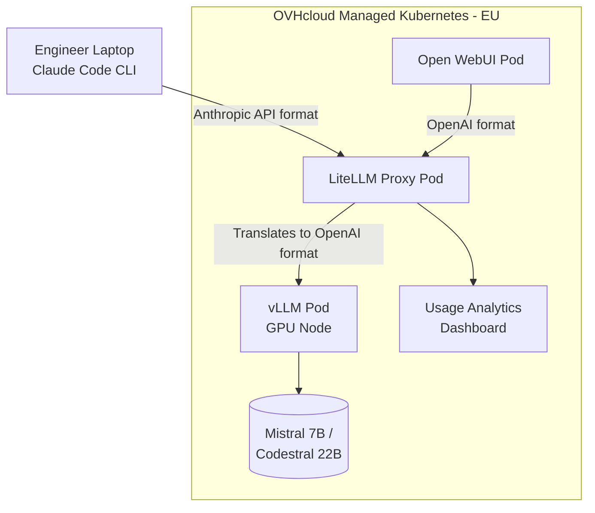
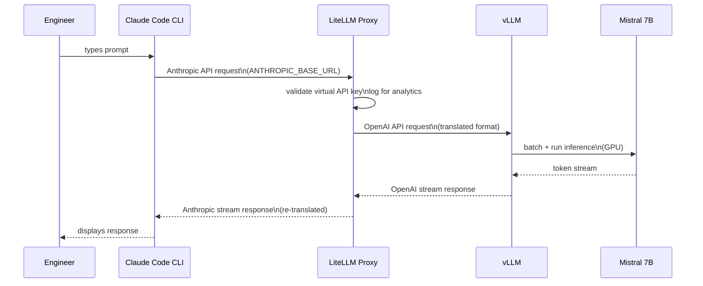

# Self-Hosted LLM for EU-Sovereign AI Coding Assistance

## Context

Medium-to-large European enterprises with sensitive data cannot grant engineers access to US-based AI coding tools (Claude, GitHub Copilot) due to data sovereignty and residency requirements. Without a sanctioned alternative, engineers resort to unofficial workarounds — creating uncontrolled data exposure that is worse than no policy at all.

The constraint is two-fold:
- **Operational**: Inference must run on EU-based infrastructure under organisational control
- **Legal**: Data must not leave EU data centers (legal compliance validation is a separate track — self-hosting addresses operational control, not full legal compliance)

Target scale: 3 engineers concurrently (POC); 10s of engineers (MVP).

## Decision

Deploy a self-hosted LLM stack on OVHcloud Managed Kubernetes (EU-based cloud provider with GPU instances and managed Kubernetes, French company, EU data centers):

- **Inference**: vLLM serving Mistral 7B (POC) or Codestral 22B (production). vLLM chosen over Ollama for production-grade concurrent request handling via continuous batching.
- **Model**: Mistral 7B for POC (fits on a single `t1-45` GPU node, 16GB VRAM Tesla V100), Codestral 22B as the documented upgrade path. Mistral chosen over Qwen3-coder 8B because Mistral is a French company — directly reinforcing the EU sovereignty narrative. Qwen3-coder 8B documented as a high-performance alternative for benchmark-driven decisions.
- **Proxy**: LiteLLM translates between Anthropic API format (Claude Code CLI) and OpenAI-compatible format (vLLM). Also manages per-engineer virtual API keys and usage analytics.
- **Clients**: Claude Code CLI on engineer laptops (pointed at LiteLLM via `ANTHROPIC_BASE_URL`) and Open WebUI as an optional browser-based chat interface.
- **Cloud**: OVHcloud chosen for its managed Kubernetes service with GPU node pool support, EU data center presence (Gravelines, France — `GRA9`), and OVHcloud's status as a French company. Note: unlike Scaleway Kapsule, OVHcloud does not pre-configure the NVIDIA GPU operator — it must be deployed as an explicit Helm step before any GPU workload.

### System Architecture

### Request Flow

## Consequences

**Positive:**
- Engineers get a sanctioned AI coding tool satisfying operational data residency requirements
- Shadow IT risk eliminated — no need for engineers to route around policy
- Per-engineer API keys enable usage tracking and cost attribution from day one
- Stack is composable: swap model (Mistral 7B → Codestral 22B → Qwen3-coder 8B) without changing proxy or client layer
- EU-headquartered cloud provider (OVHcloud) and model provider (Mistral) reinforce the sovereignty narrative end-to-end

**Negative:**
- vLLM on Kubernetes is operationally more complex than Ollama — GPU scheduling, CUDA drivers
- OVHcloud does not pre-configure the NVIDIA GPU operator; an extra Helm deploy step is required before any GPU workload
- Mistral 7B is not the highest-performing coding model; Codestral 22B (production) requires a larger GPU instance (e.g. `t1-180` with 32GB VRAM)
- LiteLLM is a single point of failure for all engineer access; proxy failure takes down the entire stack
- Legal compliance (GDPR, sector-specific regulation) is not guaranteed by self-hosting alone

**Mitigations:**
- NVIDIA GPU Operator installation is scripted as an explicit Helm step in the plan (Task 2) — one-time setup, reproducible
- Codestral 22B upgrade path is documented from day one — organisations start with Mistral 7B and graduate when needed
- LiteLLM supports horizontal scaling; document failover steps; add health checks in Helm chart
- Legal compliance caveat is explicit in all documentation to prevent overclaiming

## Risks

1. **GPU pod scheduling fails** — vLLM pod stuck in Pending due to GPU operator misconfiguration or insufficient GPU quota on OVHcloud. **Signal**: pod in Pending state with `Insufficient nvidia.com/gpu` event. **Action**: deploy NVIDIA GPU Operator (Task 2) and verify with CUDA smoke test (Task 3) before deploying vLLM.

2. **LiteLLM API translation breaks streaming** — Claude Code CLI hangs or returns auth errors because LiteLLM's Anthropic-format translation has gaps on streaming responses. **Signal**: `claude -p` hangs or returns `401`. **Action**: test with `curl` against LiteLLM before connecting Claude Code; pin LiteLLM to a known-good version.

3. **Sovereignty claim rejected by legal** — an organisation's legal team rejects self-hosting as insufficient (model weights from non-EU source, tooling telemetry, etc.). **Signal**: legal review flags the setup during procurement. **Action**: documentation explicitly frames self-hosting as operational control only; recommend a formal legal review as a separate step.
